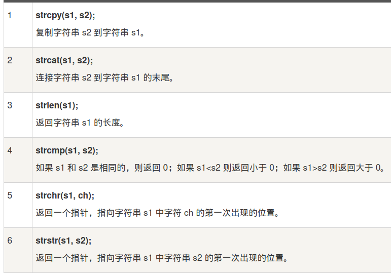

# **C/C++**
- ***.size()*** : `Array.size()`

    Access to the array length

- ***.begin()*** : `Array.begin()`

    Get the first address characters

- ***.end()*** : `Array.end()`

    Get the last address characters

- ***to_string*** : `String new_array = to_string(num)`

    The Numbers into an array

- ***sprintf*** : `sprintf(new_array,"%d",num)`
    - ***C***
        The numbers into an array

        
- ***strcpy(s1, s2)***

    Copy to s1 s2

- ***strcat(s1, s2)***

    At the end of the connection to s1 s2

- ***strlen(s1)***

    For the length of the array of s1

- ***strcmp(s1, s2)***

    If s1 and s2 are the same, it returns 0. If s1 < s2, return less than zero; And greater than zero if s1 > s2

- ***strchr(s1, ch)***

    Returns a pointer to the string s1 in the position of the first occurrence of character ch

- ***strstr(s1, s2)***

    Returns a pointer to the string string in s1 s2 position for the first time

- ***reverse*** :

    To reverse the array

    ```cpp
    1. Use func:reverse from <algorithm>
    #include <iostream>
    #include <string>
    #include <algorithm>

    int main(){

    string s = "hello";
    reverse(s.begin(), s.end());
    cout << s << endl;
    return 0;
    }

    2. DIY
    #include <iostream>
    using namespace std;

    void Reverse( char *s, int n){
    for ( int i=0,j=n-1;i<j;i++,j--){
    char c=s[i];
    s[i]=s[j];
    s[j]=c;
    }
    }

    int main()
    {

    char s[]= "hello" ;
    Reverse(s,5);
    cout << s << endl;

    return 0;
    }

    3. Use func:strrev from string.h
    #include<iostream>
    #include <cstring>

    int main(){

    char s[]="hello";
    strrev(s);
    cout << s << endl;

    return 0;
    }
    ```

- ***INT_MAX INT_MIN***

    - 因为int占4字节32位，根据二进制编码的规则:

        `INT_MAX`  = 2^31-1，`INT_MIN` = -2^31.

    - C/C++中，所有超过该限值的数，都会出现溢出，出现warning，但是并不会出现error。
    - 如果想表示的整数超过了该限值，可以使用长整型long long 占8字节64位。

- ***lower_bound & upper_bound***
   - ***lower_bound(first, last, val)***

       查找返回第一个大于等于目标值的元素的位置

   - ***upper_bound(first, last, val)***

       查找返回第一个大于目标值的元素的位置

- ***sort(begin(), end())***
- ***sort(begin(), end(), [xxx<TypeData>])***

    **DEAFULT:**
    - ***less<TypeData>***
        From small to large

    - ***greater<TypeData>***
        From large to small


```cpp
#include<iostream>
#include<algorithm>

using namespace std;

int main()
{
int a[10]={9,6,3,8,5,2,7,4,1,0};

for(int i=0;i<10;i++)
cout << a[i] << endl;

sort(a,a+10,less<int>());

return 0;
}


#include<iostream>
#include<algorithm>

using namespace std;

int main()
{
int a[10]={9,6,3,8,5,2,7,4,1,0};

for(int i=0;i<10;i++)
cout << a[i] << endl;

sort(a,a+10,greater<int>());

return 0;

}
```
